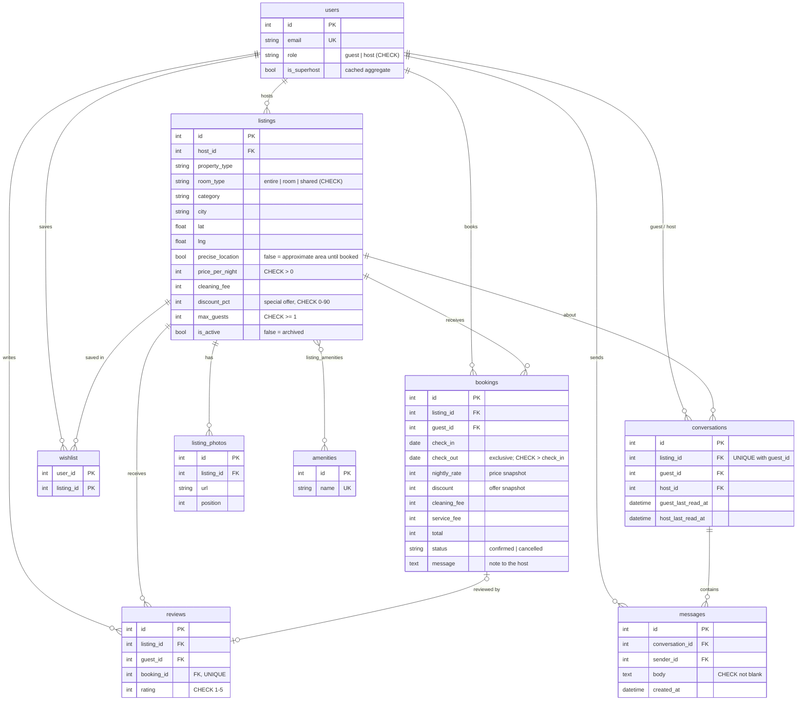

# Airbnb Clone

A full-stack Airbnb clone: browse and search stays, view a listing, book dates without clashes, message hosts, and manage listings as a host. The UI follows Airbnb's current web design: the All / Homes / Experiences / Services tabs, the collapsing search bar, galleries, date pickers, the "Confirm and pay" flow, modals, toasts and a split list/map search view.

**Live demo:** _added after deployment_ · **Stack:** Next.js 14 (TypeScript, Tailwind) · FastAPI · SQLAlchemy 2 · SQLite

---

## Quick start

```bash
# 1. Backend (Python 3.11+)
cd backend
python -m venv .venv && source .venv/bin/activate
pip install -r requirements-dev.txt
python seed.py                    # optional: the server also seeds an empty database on start
uvicorn app.main:app --reload     # http://localhost:8000  (API docs at /docs)
pytest                            # 62 tests

# 2. Frontend (Node 18+)
cd frontend
cp .env.local.example .env.local  # NEXT_PUBLIC_API_URL=http://localhost:8000/api
npm install
npm run dev                       # http://localhost:3000
```

**Demo accounts** (login is mocked, so no passwords are needed). The login dialog comes pre-filled with the demo guest; flip the **Guest / Host** switch to fill in the demo host, then click **Continue**. The first login on each account shows Airbnb's "Everyone belongs here" Community Commitment.

| Role | Pre-filled | Other accounts (type the email) |
|---|---|---|
| Guest | `isha@demo.com` (has past stays to review and messages) | `kabir@demo.com`, `meera@demo.com`, `vikram@demo.com`, `sana@demo.com` |
| Host | `aarav@demo.com` (Superhost) | `ananya@demo.com`, `rohan@demo.com` |

---

## Features

| Area | What works |
|---|---|
| **Home & search** | **All** and **Homes** tabs with city rows (7 cards across on a 1440px screen, like Airbnb). The search bar collapses into a compact pill as you scroll. Search by location, dates and guests, with category chips, a filters modal (price, property type, bedrooms, amenities) and infinite scroll. Desktop shows a split list/map view with price pins; phones get a *Show map* toggle. |
| **Special offers** | About 2 in 5 listings run a 10–25% offer: cards, map pins, the booking card and checkout show the original price crossed out, and checkout lists a green "Special offer" line. Hosts set the offer on each listing. Price filters use the price guests actually pay. |
| **Listing page** | Title with Share / Save, a 5-photo grid, summary, host card ("Superhost · N years hosting") with **Message host**, highlights, description, amenities with icons, a two-month calendar (the first free night is pre-selected), "Prices include all fees", the booking card with a live price breakdown, reviews, a location map, and a section nav (Photos / Amenities / Reviews / Location) that appears on scroll. |
| **Booking** | Reserve works logged out: **Confirm and pay** shows "1. Log in or sign up", and Continue opens the login as a dialog over the page. Once logged in: **Message the host** (required before paying), then a mocked Razorpay payment step. Date and guest validation, editable dates and guests on the checkout page, a confirmation banner, and My Trips (upcoming / past / cancelled). Guests can cancel before check-in, which frees the dates. |
| **Messaging** | Real guest ↔ host conversations: one thread per listing and guest. A booking's note to the host starts the thread; guests can also message a host from any listing. Inbox with unread dots, unread badges on the menu, hosting tabs and phone tab bar, and the open thread refreshes every few seconds. |
| **Host** | A hosting area with its own header (**Today, Calendar, Listings, Messages**, "Switch to travelling"). Today groups reservations into checking out / currently hosting / arriving soon / upcoming, with guest messages and payouts, plus earnings. Calendar shows each night's price or the booked guest. New listings go through Airbnb's step-by-step **Become a host** wizard (`/become-a-host/<step>`): address search with live suggestions, an animated house on the Step 1/2/3 intros, 30 property types, entire place / room / shared room, a drag-to-position map pin and a "Show precise location" switch, guests and rooms, amenities, at least 5 uploaded photos, title, description, price with the guest fee breakdown, a special offer, then review and publish. Progress is saved as you go, so **Save & exit** resumes from Listings. Existing listings are edited with a single form. Removal follows Airbnb's rule: it is **blocked while reservations are upcoming**; otherwise the listing is archived. |
| **Experiences & Services** | Tabs laid out like Airbnb's (tiles, Originals, "Happening today", category rows) with sample cards. |
| **Extras** | Wishlist, toasts, one review per completed stay, Superhost computed from reviews, image upload, dark mode (Auto/Light/Dark, in the account menu), the logged-in account menu (Wishlists, Trips with an upcoming count, Messages, Profile), responsive from phone to desktop. |
| **Placeholders** | Payments (mocked, nothing is charged), booking Experiences and Services, notifications, gift cards, Google/Apple sign-in and identity verification show "coming soon". |

---

## Architecture

```
┌──────────────── Next.js (App Router) ────────────────┐        ┌────────────── FastAPI ──────────────┐
│ app/*/page.tsx    thin route files                   │  JSON  │ routers/   HTTP layer per resource   │
│ components/*      views + reusable UI                │ ─────▶ │ deps.py    mock auth, role guard     │
│ context/*         user, toasts, auth modals          │ X-User │ services.py business rules           │
│ lib/api.ts        fetch wrapper (adds X-User-Id)     │  -Id   │ schemas.py Pydantic in/out models    │
│ lib/theme.ts      light/dark tokens                  │        │ models.py  SQLAlchemy tables         │
└──────────────────────────────────────────────────────┘        └──────────────┬──────────────────────┘
                                                                               ▼
                                                                    SQLite (+ trigger, CHECKs)
```

- **The URL holds the search state.** `/search?q=Goa&check_in=…&guests=2&amenity_ids=1` means refresh, Back and shared links all work, and the API takes the same query parameters.
- **Business rules sit in `services.py`.** The overlap check, price quote, rating aggregation and Superhost rule live there, so routers stay thin and tests can target the rules directly.
- **Mocked auth with real roles.** The frontend stores the chosen demo user and sends `X-User-Id`. `get_current_user` returns 401 for a missing or unknown user, and `require_host` returns 403 for guests. Swapping in real auth would only change `deps.py`.
- **Client components fetch from the API.** Pages show skeletons while loading. The map loads only in the browser (`next/dynamic`, `ssr: false`) because Leaflet needs `window`.
- **Messaging polls instead of using websockets.** The open thread refreshes every 4 seconds and the inbox every 8. The unread count is a single shared poll (every 20 seconds, and straight away after reading a thread) that every badge subscribes to. That keeps the backend a plain REST API on a free host.
- **Existing databases upgrade themselves.** On start the backend creates any new tables, adds columns that later versions introduced (`database.ADDED_COLUMNS`), and turns old booking notes into conversations, so a deployed SQLite file never needs a manual migration.

---

## Database schema



**Design decisions**
- **Date ranges are half-open `[check_in, check_out)`.** Two stays overlap when `a.check_in < b.check_out AND a.check_out > b.check_in`, so one guest can check out on the morning the next one checks in.
- **Double-booking is prevented twice.** The API checks availability first so it can return a friendly 409. A `BEFORE INSERT` **trigger** in SQLite rejects any overlapping confirmed booking. SQLite runs writes one at a time, so the trigger still holds when two requests race past the API check together (covered by a test).
- **Prices are snapshotted on the booking.** Editing a listing's price or offer later doesn't change past trips or host earnings.
- **Special offers round .5 up, everywhere.** The discount is `(amount × pct + 50) // 100` in Python and SQL, and `Math.round` in the browser, so a card, the quote and checkout never disagree by a rupee. The service fee is charged on the discounted stay.
- **One conversation per listing and guest** (a unique constraint). Bookings and "Message host" both post into it. Unread counts come from each side's `last_read_at` rather than a flag per message, so reading a thread is one update.
- **Soft states instead of deletes.** Cancelling sets `status = 'cancelled'` (the dates are freed, the history stays). Removing a listing sets `is_active = false`, which hides it from search and wishlists, while past trips and reviews still point at it.
- **One review per stay.** `reviews.booking_id` is unique. Seeded reviews have no booking, so the column is nullable.
- **Superhost is a cached aggregate.** It is recomputed whenever a review is added: at least 10 reviews averaging 4.7 or higher across the host's listings. A simplified version of Airbnb's rule.
- **Indexes** cover what's queried most: `(listing_id, check_in, check_out)` on bookings for availability, plus `host_id`, `city`, `category`, `property_type` and `is_active` on listings.
- **Foreign keys are enforced.** SQLite ignores them unless `PRAGMA foreign_keys=ON` is set, so it runs on every connection.

---

## API overview

All routes are under `/api`. Interactive docs are at `/docs`. 🔒 = needs `X-User-Id`; 🏠 = host only.

| Method | Path | Purpose |
|---|---|---|
| GET | `/listings` | Search: `q, check_in, check_out, guests, min_price, max_price` (after offers), `property_type, category, bedrooms, amenity_ids[], page, page_size` (max 120) returns `{items, page, has_more, total}` |
| GET | `/listings/{id}` | Detail with photos, amenities, host and reviews |
| GET | `/listings/{id}/availability` | Upcoming booked ranges for the calendar |
| GET | `/listings/{id}/quote` | Price breakdown for `check_in` / `check_out` |
| POST 🔒 | `/listings/{id}/reviews` | Review a completed, not-yet-reviewed stay |
| POST 🔒 | `/bookings` | Book (`message` to the host is required): 409 on overlap, 422 for invalid dates, guest count or a blank message, 400 for your own listing |
| GET 🔒 | `/trips` | My bookings, with listing card and `reviewed` flag |
| DELETE 🔒 | `/bookings/{id}` | Cancel before check-in (soft) |
| GET/POST 🏠 | `/host/listings` | My active listings (with `upcoming_bookings`) / create (including `discount_pct`) |
| PUT/DELETE 🏠 | `/host/listings/{id}` | Edit / remove (409 while reservations are upcoming, else archive) |
| GET 🏠 | `/host/bookings` | Bookings on my listings |
| GET/POST/DELETE 🔒 | `/wishlist[/{id}]` | Favourites (adding is idempotent) |
| GET 🔒 | `/conversations` | My inbox (as guest or host): other person, listing, last message, `unread`, latest stay |
| GET 🔒 | `/conversations/unread` | `{count}` of unread messages, for badges |
| POST 🔒 | `/conversations` | "Message host": `{listing_id, body}` opens or reuses the thread and sends the message |
| GET 🔒 | `/conversations/{id}` | Thread with messages; marks it read. 404 unless you're its guest or host |
| POST 🔒 | `/conversations/{id}/messages` | Send `{body}` (1–2000 characters) |
| POST 🏠 | `/uploads` | Image upload (JPEG/PNG/WebP, max 5 MB), returns its URL |
| GET | `/amenities`, `/users` | Filter options; demo accounts for the login screen |

---

## Testing

`backend/tests` holds 57 pytest tests, each run on a fresh throwaway database:
- search filters and pagination
- quote math and every booking validation
- overlap from all directions, including a simulated race caught by the trigger
- cancel rules, host permissions and CRUD
- archive-instead-of-delete
- one review per stay and Superhost thresholds
- wishlist, upload limits, CHECK constraints, foreign-key cascades and seed integrity
- special offers: quote math, .5 rounding, offer-price filters and hosts setting offers
- messaging: threads, unread counts, who can read a thread, validation, booking notes becoming messages, backfill
- upgrading an old database (missing columns are added on start)

---

## Deployment (all free tiers)

| Part | Where | Settings |
|---|---|---|
| Frontend | Vercel Hobby (root: `frontend/`) | `NEXT_PUBLIC_API_URL=https://<backend>.onrender.com/api` |
| Backend | Render free web service, from `render.yaml` (root: `backend/`) | `CORS_ORIGINS=https://<frontend>.vercel.app` |
| Keep-awake | GitHub Actions (`.github/workflows/keep-awake.yml`) | Repo variable `BACKEND_URL=https://<backend>.onrender.com` |

Render's free plan sleeps after 15 idle minutes and has no persistent disk. The backend seeds itself whenever it starts with an empty database, so the demo is always usable. The keep-awake job pings `/health` every 10 minutes, which avoids the ~1 minute cold start and keeps bookings made during a session.

---

## Assumptions

- **Currency and data:** amounts are whole rupees (INR); data is set in India across 12 cities, 10 listings each. The service fee is 14% of the nightly subtotal after any special offer; cleaning fees are per stay.
- **Auth:** mocked by choosing a demo account. Each account is either a guest or a host, as the assignment asks. Hosts can't book their own listings.
- **Bookings:** confirmed instantly with mocked payment (no request-to-book step). "Continue to Razorpay" opens a demo payment step; nothing is charged and no card details are collected. Guests can cancel any time before check-in; refund policies aren't modelled.
- **Location:** "nearby" sections (e.g. "Services in Gurgaon District") use a fixed area rather than the visitor's location.
- **Hosting:** free tiers only. Render's free plan wipes the SQLite file when the service restarts or is redeployed, so data then resets to the demo set and uploaded images are lost. Locally, and on any host with a persistent disk (set `DATABASE_URL` and `UPLOAD_DIR`), everything persists.
- **Photos:** from Unsplash (free licence). Map tiles: © OpenStreetMap contributors. Avatars: pravatar.cc.
- **Airbnb assets:** the tab, category and host-illustration images in `frontend/public/icons` are Airbnb's own, used to make this non-commercial assignment clone match the original.
- **Font:** the site asks for **Airbnb Cereal** first. It is Airbnb's proprietary typeface, so it is not in this repo: drop a licensed `AirbnbCerealVF.woff2` into `frontend/public/fonts/` to use it. Until then it falls back to **Figtree**, a free font with similar proportions.
- **Placeholders:** booking Experiences and Services, notifications, gift cards and social login are "coming soon". Experiences and Services show sample data.
