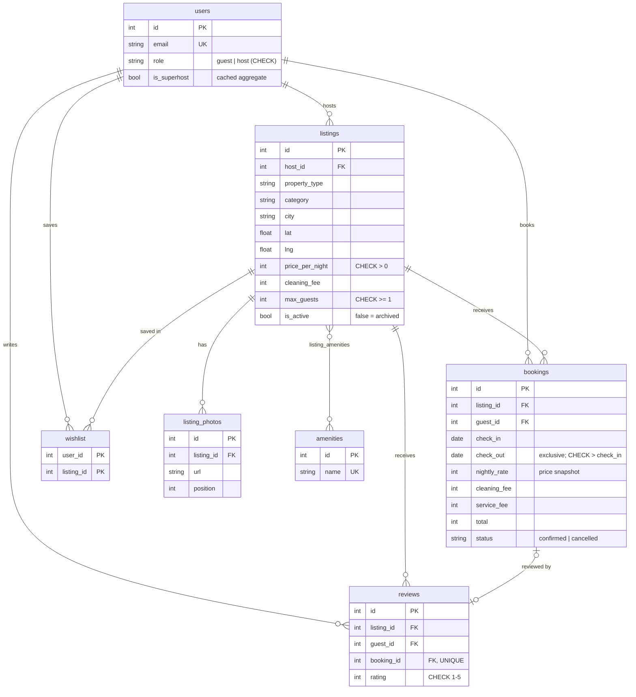

# Airbnb Clone

A full-stack Airbnb clone: browse and search stays, view a listing, book dates without clashes, and manage listings as a host. The UI follows Airbnb's current web design: the explore grid, the search pill, galleries, date pickers, modals, toasts and a split list/map search view.

**Live demo:** _added after deployment_ · **Stack:** Next.js 14 (TypeScript, Tailwind) · FastAPI · SQLAlchemy 2 · SQLite

---

## Quick start

```bash
# 1. Backend (Python 3.11+)
cd backend
python -m venv .venv && source .venv/bin/activate
pip install -r requirements-dev.txt
python seed.py                    # optional: the server also seeds an empty database on start
uvicorn app.main:app --reload     # http://localhost:8000  (API docs at /docs)
pytest                            # 42 tests

# 2. Frontend (Node 18+)
cd frontend
cp .env.local.example .env.local  # NEXT_PUBLIC_API_URL=http://localhost:8000/api
npm install
npm run dev                       # http://localhost:3000
```

**Demo accounts** (login is mocked, so no passwords are needed). On the login screen, choose *I'm travelling* or *I'm hosting*:

| Role | Accounts |
|---|---|
| Host | `aarav@demo.com` (Superhost), `ananya@demo.com`, `rohan@demo.com` |
| Guest | `isha@demo.com` (has past stays to review), `kabir@demo.com`, `meera@demo.com`, `vikram@demo.com`, `sana@demo.com` |

---

## Features

| Area | What works |
|---|---|
| **Home & search** | City rows on the home page. Search by location, dates and guests, with category chips, a filters modal (price, property type, bedrooms, amenities) and infinite scroll. Desktop shows a split list/map view with price pins; phones get a *Show map* toggle. |
| **Listing page** | Photo gallery, details, amenities, host card with Superhost badge, a two-month availability calendar with booked dates crossed out, live price breakdown, reviews and a location map. |
| **Booking** | Date and guest validation, a mocked "Confirm and pay" checkout, a confirmation banner, and My Trips (upcoming / past / cancelled). Guests can cancel before check-in, which frees the dates. |
| **Host** | Dashboard with stats, listings and incoming bookings. Create and edit listings (photos by URL or upload, amenities, pricing). Removal follows Airbnb's rule: it is **blocked while reservations are upcoming**; otherwise the listing is archived. |
| **Extras** | Wishlist, toasts, one review per completed stay, Superhost computed from reviews, image upload, dark mode (Auto/Light/Dark), responsive from phone to desktop. |
| **Placeholders** | Payments (mocked), messaging, Experiences, Services, Google/Apple sign-in and identity verification show "coming soon". |

---

## Architecture

```
┌──────────────── Next.js (App Router) ────────────────┐        ┌────────────── FastAPI ──────────────┐
│ app/*/page.tsx    thin route files                   │  JSON  │ routers/   HTTP layer per resource   │
│ components/*      views + reusable UI                │ ─────▶ │ deps.py    mock auth, role guard     │
│ context/*         user, toasts, auth modals          │ X-User │ services.py business rules           │
│ lib/api.ts        fetch wrapper (adds X-User-Id)     │  -Id   │ schemas.py Pydantic in/out models    │
│ lib/theme.ts      light/dark tokens                  │        │ models.py  SQLAlchemy tables         │
└──────────────────────────────────────────────────────┘        └──────────────┬──────────────────────┘
                                                                               ▼
                                                                    SQLite (+ trigger, CHECKs)
```

- **The URL holds the search state.** `/search?q=Goa&check_in=…&guests=2&amenity_ids=1` means refresh, Back and shared links all work, and the API takes the same query parameters.
- **Business rules sit in `services.py`.** The overlap check, price quote, rating aggregation and Superhost rule live there, so routers stay thin and tests can target the rules directly.
- **Mocked auth with real roles.** The frontend stores the chosen demo user and sends `X-User-Id`. `get_current_user` returns 401 for a missing or unknown user, and `require_host` returns 403 for guests. Swapping in real auth would only change `deps.py`.
- **Client components fetch from the API.** Pages show skeletons while loading. The map loads only in the browser (`next/dynamic`, `ssr: false`) because Leaflet needs `window`.

---

## Database schema



**Design decisions**
- **Date ranges are half-open `[check_in, check_out)`.** Two stays overlap when `a.check_in < b.check_out AND a.check_out > b.check_in`, so one guest can check out on the morning the next one checks in.
- **Double-booking is prevented twice.** The API checks availability first so it can return a friendly 409. A `BEFORE INSERT` **trigger** in SQLite rejects any overlapping confirmed booking. SQLite runs writes one at a time, so the trigger still holds when two requests race past the API check together (covered by a test).
- **Prices are snapshotted on the booking.** Editing a listing's price later doesn't change past trips or host earnings.
- **Soft states instead of deletes.** Cancelling sets `status = 'cancelled'` (the dates are freed, the history stays). Removing a listing sets `is_active = false`, which hides it from search and wishlists, while past trips and reviews still point at it.
- **One review per stay.** `reviews.booking_id` is unique. Seeded reviews have no booking, so the column is nullable.
- **Superhost is a cached aggregate.** It is recomputed whenever a review is added: at least 10 reviews averaging 4.7 or higher across the host's listings. A simplified version of Airbnb's rule.
- **Indexes** cover what's queried most: `(listing_id, check_in, check_out)` on bookings for availability, plus `host_id`, `city`, `category`, `property_type` and `is_active` on listings.
- **Foreign keys are enforced.** SQLite ignores them unless `PRAGMA foreign_keys=ON` is set, so it runs on every connection.

---

## API overview

All routes are under `/api`. Interactive docs are at `/docs`. 🔒 = needs `X-User-Id`; 🏠 = host only.

| Method | Path | Purpose |
|---|---|---|
| GET | `/listings` | Search: `q, check_in, check_out, guests, min_price, max_price, property_type, category, bedrooms, amenity_ids[], page, page_size` returns `{items, page, has_more, total}` |
| GET | `/listings/{id}` | Detail with photos, amenities, host and reviews |
| GET | `/listings/{id}/availability` | Upcoming booked ranges for the calendar |
| GET | `/listings/{id}/quote` | Price breakdown for `check_in` / `check_out` |
| POST 🔒 | `/listings/{id}/reviews` | Review a completed, not-yet-reviewed stay |
| POST 🔒 | `/bookings` | Book: 409 on overlap, 422 for invalid dates or guest count, 400 for your own listing |
| GET 🔒 | `/trips` | My bookings, with listing card and `reviewed` flag |
| DELETE 🔒 | `/bookings/{id}` | Cancel before check-in (soft) |
| GET/POST 🏠 | `/host/listings` | My active listings (with `upcoming_bookings`) / create |
| PUT/DELETE 🏠 | `/host/listings/{id}` | Edit / remove (409 while reservations are upcoming, else archive) |
| GET 🏠 | `/host/bookings` | Bookings on my listings |
| GET/POST/DELETE 🔒 | `/wishlist[/{id}]` | Favourites (adding is idempotent) |
| POST 🏠 | `/uploads` | Image upload (JPEG/PNG/WebP, max 5 MB), returns its URL |
| GET | `/amenities`, `/users` | Filter options; demo accounts for the login screen |

---

## Testing

`backend/tests` holds 42 pytest tests, each run on a fresh throwaway database:
- search filters and pagination
- quote math and every booking validation
- overlap from all directions, including a simulated race caught by the trigger
- cancel rules, host permissions and CRUD
- archive-instead-of-delete
- one review per stay and Superhost thresholds
- wishlist, upload limits, CHECK constraints, foreign-key cascades and seed integrity

---

## Deployment (all free tiers)

| Part | Where | Settings |
|---|---|---|
| Frontend | Vercel Hobby (root: `frontend/`) | `NEXT_PUBLIC_API_URL=https://<backend>.onrender.com/api` |
| Backend | Render free web service, from `render.yaml` (root: `backend/`) | `CORS_ORIGINS=https://<frontend>.vercel.app` |
| Keep-awake | GitHub Actions (`.github/workflows/keep-awake.yml`) | Repo variable `BACKEND_URL=https://<backend>.onrender.com` |

Render's free plan sleeps after 15 idle minutes and has no persistent disk. The backend seeds itself whenever it starts with an empty database, so the demo is always usable. The keep-awake job pings `/health` every 10 minutes, which avoids the ~1 minute cold start and keeps bookings made during a session.

---

## Assumptions

- **Currency and data:** amounts are whole rupees (INR); data is set in India across 12 cities. The service fee is 14% of the nightly subtotal; cleaning fees are per stay.
- **Auth:** mocked by choosing a demo account. Each account is either a guest or a host, as the assignment asks. Hosts can't book their own listings.
- **Bookings:** confirmed instantly with mocked payment (no request-to-book step). Guests can cancel any time before check-in; refund policies aren't modelled.
- **Hosting:** free tiers only. Render's free plan wipes the SQLite file when the service restarts or is redeployed, so data then resets to the demo set and uploaded images are lost. Locally, and on any host with a persistent disk (set `DATABASE_URL` and `UPLOAD_DIR`), everything persists.
- **Photos:** from Unsplash (free licence). Map tiles: © OpenStreetMap contributors. Avatars: pravatar.cc.
- **Placeholders:** Experiences, Services, messaging and social login are "coming soon".
